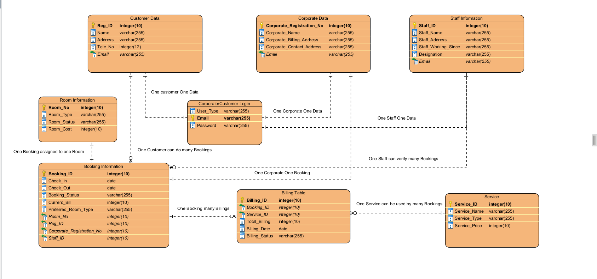

# Hotel Online Booking and Management System 

  

This is a group project of creating a Hotel Booking and Management System in Java, to outline the uses of Object Oriented Programming and Database Management System.

## Entity-Relationship Diagram:

  

## Application Features:

- **Book a Room** : Book a room based on the Room size, type, and cost

  

- **Order a service**

  

  
- **Check Bill Status**

## Admin Page Features: 

- **Check all rooms booked**
  

  

## Prajjwal Veer Basnet, Rohit Shahi, Diwas Suyal
